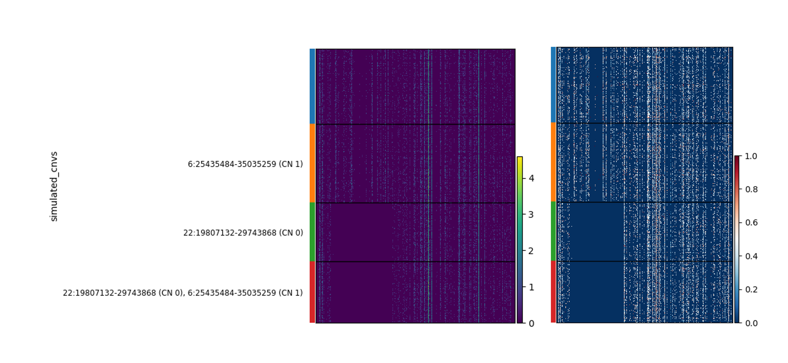

# Final Project

!!!warning "*'I heard the jury is still out on science'* --GOB from Arrested Development"

    Now is your chance to flex your single cell analysis muscles. You are a beast. Show us what you can do! { align=right width=250 } In the final project, you will develop a new analysis method, benchmark it, and then you will use it to address an open question in stem cell biology. 
    
    Deadline: **Wednesday May 7th 11:59pm**

    Absolutely **NO Extensions**

    Really, no extensions.


## Introduction
DNA copy number alterations (CNA) have been detected in embryonic stem cells (ESC) and induced pluripotent stem cells (iPSC -- we will refer to pluripotent stem cells of any variety as PSCs). The origins of CNAs in PSCs is varied. Some likely arise as an adaptation to life in culture.[^1] Some may arise from somatic mosaicism in iPSC founder cell population[^2]. And some may arise during the programming process itself.[^3],[^4] 

CNAs in PSCs can be problematic. The lesions may be tumorigenic, they may hinder differentiation generally or derivation of specific lineages[^5], and they may obscure disease-specific phenotypes when the PSC is used for disease modeling. (Please check out this review[^6] and references therein for a comprehensive discussion). Therefore, methods to detect CNAs in PSCs would be highly useful. There are lots of experimental ways to detect CNAs, including karyotyping, FISH, array comparative genomic hybridization, single nucleotide polymorphism (SNP) arrays[^3], and genome sequencing. In 2010, a method called e-karyotyping was published that attempted to infer CNAs based on expression of genes co-located in the genome[^7]. This is cool because it leverages data that already exists. In effect, this method is a 'twofer': where you get two things for the price of one. However, it makes the assumption that DNA copy number is reflected by expression levels of genes that are co-located in the genome.

The pressing question for your team is to define the distribution of CNAs in human PSCs using available scRNA-seq data. To achieve this, you will have to develop a tool that identifies CNAs from scRNA-seq, evaluate its performance, apply it to PSCs, and synthesize your findings with those previously reported in the literature. More details can be found below as well as specifications that distinguish what is required for 447 and 647 teams.

!!!note "Terminology"

    Sometimes I might refer to CNAs as CNVs. I use these terms interchangably but some might argure that they are different things. Regardless, if you see a mention of 'CNV' here, just mentally substitute in 'CNA'


## Your mission

### Task 1: Create a method that infers CNAs from scRNA-seq data

Write a Python package that allows users to define the *genotype* and genomic region of CNAs from scRNA-seq data. *genotype* in this case can be either 'gain' or 'loss'. The minimal input is an annData object that contains raw expression counts of genes that are named in the .var slot across the cells listed in the .obs slot. The output should be:

1. a list of CNAs where each CNA is defined by genomic region (chromosome, start, stop,) and some indication of the type of CNA (e.g. 'gain' | loss')
2. an assignment of CNAs to cells, or to groups of cells.

This output should be structured to facilitate CNA visualization [as we show below](#cna-benchmarking-data). It is OK for your function to add this output to the input adata.

Other requirements:

* The method must be written in Python
* The code must be housed at GitHub
* The code must be organized following Python package conventions. [See this tutorial as a guide.](https://packaging.python.org/en/latest/tutorials/packaging-projects/) Note that you do not have to upload it to PyPI. 
* Your repo must contain documentation that describes how to install your package and how to use it. The easiest place to put this information is in a README.md file.

Here are some more things to consider:

* Most of the time, annData objects do not contain genomic regions for their genes, so you need to do something about this. 
* Other attempts to solve this problem include gene-specific normalization based on comparison of each cell or sample to a diploid control. How these control samples use for comparison is selected is important.
* We recommend that you test your ideas on minimally sufficient slices of the [test data](#cna-benchmarking-data) that we provide.
* Check out the following papers and resources for ideas:
	* Benchmarking CNA prediction methods paper[^8]
	* [Python port of the InferCNV method](https://infercnvpy.readthedocs.io/en/latest/index.html)

### Task 2: Assessment

#### Task 2A: Assess the performance of your method

Apply your method to the test data that we provided. Analze your method's performance in terms of standard metrics such as accuracy, or area under precision recall curves. If your method scores CNAs to reflect confidence in their prediction, then also evaluate this aspect. If your method has tunable parameters, then evaluate its performance across a well-justified range of parameter value combinations.

Other requirements:

* Explore the impact of read depth on your method's performance. Scanpy has functions for down-sampling
* Notebooks that document this task's analysis must be included in your GitHub repo

#### Task 2B: Augment assessment with better gold standard data


!!!tip "647 only!"

    This task is required for only for 647 teams. 447 teams are allowed to complete it for extra credit.

The validatation data is very limited. There are only 3 CNAs, and they do not vary much in size or frequency. To assess your method more robustly, generate or acquire gold standard data that has CNAs that:

* have wider range of sizes
* have wider ranges of frequencies

Use this extended gold standard data to evaluate your methods ability to resolve CNAs from small to large, and to detect CNAs across frequencies. 

If you choose to simulate a gold standard data as we have done, then you must include your simulation functionality in your method's package. If you acquire gold standard data, then you must report the precise source, how the CNA's were defined, and include in your repo any pre-processing of the data required to make it amenable to your analysis.

Other requirements:
* Notebooks that document this task's analysis must be included in your GitHub repo

### Task 3: Measure CNA in PSCs

Now that you have developed and assessed your method, it is time to use it! Take a look at [the list of PSC scRNA-seq data below](#psc-scrnaseq-data). Find an optimal subset of these datasets to see if you can infer previously reported PSC CNAs and to discover new ones.

Things to consider:

* You do not have to analyze all of these data sets
* You may analyze other data sets that you find as long as they are either human PSCs or their derivatives
* You may need to integrate data across studies to infer CNAs that are cell line specific

Other requirements:
* Notebooks that document this task's analysis must be included in your GitHub repo

### Task 4: Predict CNA impact 

!!!tip "Extra credit"

    This task is not required. It is a bonus task and will be scored as extra-credit.

Devise and apply a method to predict the functional impact on PSCs of CNAs in catalog that you generated in Task 3. 

Other requirements:
* Notebooks that document this task's analysis must be included in your GitHub repo 

### Deliverables 

Your grade in this project has a team component and an individual component. All team members will receive the same grade on the team component, but individuals from the same team can receive different grades on the individual component. Below is a summary of each deliverable in the Team and Individual parts. 

#### Team deliverables

1. A link to a GitHub repository that is home to your Python package. This link should be included in the paper that you send us (see deliverable 2).
2. Write a paper that describes your tool and its application to characterize CNAs in PSCs. Your paper should follow the 'Problem solving article' format described [here](https://academic.oup.com/bib/pages/General_Instructions#Types%20of%20Manuscript) for the journal *Briefings in Bioinformatics*. This article type is described as:

!!!quote "Paper format"
	Problem solving protocols: development of methods based on comparison, new software, or new pipeline of existing software for solving a specific bioinformatics problem. Real experimental data must be analyzed. Problem solving protocol papers should demonstrate a new methodological application to a meaningful biological problem. Original algorithms also accepted. (2000-5000 words)

Your paper must address how you completed each Task and your results. If your team went after Task 4, then your approach and results should also be included in the paper. You must include display items that clearly represent your work. Please try to format the display items as if you were really going to submit this to a journal. For example, each figure should fit on one page, axes clearly labeled. This makes the reading experience so much more enjoyable for your audience and these positive vibes tend to translate into higher scores.

3. A pre-recorded presentation in which you show off your tool and what you learned by its application. Send us your slides, too.
4. Attendance at the presentation viewing and Q & A session on the morning of May 12th. At least one team member must participate (in person or via Zoom) and be prepared to answer questions following the showing of their teams video. 

#### Individual deliverables

1. Your assessment of your teamates contributions to the final project. 
	* Please score each team member from 1 (superlative) to 10 (unacceptable) in the following categories:
		* Contributed to team discussions and planning
		* Fulfilled their assigned tasks
		* Timeliness of contributions
		* Responsiveness to intra-team communications
		* Pro-active member of the team
	* For each team member, write 1-3 sentences that summarizes their role in the project and any other comments

2. Your assessment of another team's final project. Each student will be assigned to read another teams paper or test their code. In this deliverable, you must score the code or paper with the scoring system: 1 (superlative) to 10 (unacceptable) for the following categories.
	* Paper
		* Does the paper address Task 1?
		* Does the paper address Task 2?
		* Does the paper address Task 3?
		* Clarity of writing
		* Depth of thought in discussion
		* Appropriate framing of background in Introduction
		* Use of appropriate display items (i.e. tables and figures)
		* Finish your paper evaluation with a written summary of one paragraph and overall score (1-10). The summary might include specific examples from the paper for improvement or examples of excellent work.
	* Code
		* Ease of installation
		* Clarity of documentation, including guidance for any parameter tuning
		* Ease of running example(s) provided in README
		* Experience when applying to a user-provided dataset
		* Reproducibility of Task analysis notebooks

### Data

#### CNA benchmarking data
[PBMC_simulated_cnas_041025.h5ad](https://jhu.instructure.com/files/13967706/download?download_frd=1). We have created a scRNAseq dataset with defined CNAs. It is based on the PBMC data used earlier in course, but we have simulated the impact on expression of genes that overlap with three CNAs. One is on Chr X (a copy number gain), one is on Chr 22 (a homozygous loss -- both alleles were deleted), and one is on Chr 6 (a heterozygous loss -- only one allele was deleted). The CNA *genotype* (that is, the set of specfic genetic variants of a sample -- in this case, the set of CNAs that a cell has) of each cells is stored in `adata.obs["simulated_cnvs"]`, which also indicates the precise genomic coordinates of the CNAs and its copy number (CN):

``` py
adata.obs['simulated_cnvs'].value_counts()
simulated_cnvs
                                                           6312
X:106533974-112956833 (CN 4)                               1731
6:25435484-35035259 (CN 1)                                  895
22:19807132-29743868 (CN 0), 6:25435484-35035259 (CN 1)     700
22:19807132-29743868 (CN 0)                                 671 
```

The CNAs were simulated in a cell-type specific manner, meaning that each CNA appears only in one cell type, but not in all cells of that cell type. In this case, CD4 T cells have the ChrX gain, and CD14 monocytes have the Chr6 and Chr22 losses. This is a bit more complicated a situation that one might expect to face when inferrring CNAs from undifferentiated PSCs, but we include it here because some of the PSC data provided also include differentiated progeny. To quickly view how the CNAs impact expression, you could plot a heatmap in which the cells are the rows, grouped by genotype, and the columns are genes, ordered by genomic position:

``` py
# get slice of cd14 monocytes and Chr22
adMono = adata[adata.obs['cell_type'] == 'CD14 monocyte'].copy()
adChr22 = adMono[:,adMono.var['chromosome']=='22'].copy()
# Raw counts on left
sc.pl.heatmap(adChr22, adChr22.var_names, groupby='simulated_cnvs',layer="counts", log=True)
# gene-scaled on right makes the CNA footprint more apparent
sc.pl.heatmap(adChr22, adChr22.var_names, groupby='simulated_cnvs',layer="counts", log=True, standard_scale='var')
```




The CNA is evident as a region with no expression in a subset of the cells.

#### PSC scRNAseq data

Here is a list of publicly available scRNA-seq data of human PSCs and/or their differentiated progeny. Note that in some cases, we were able to easily find the name of the PSC cell line(s), but in other cases you will have to do this yourself.

1. 2D gastruloids
	* Data: https://www.ncbi.nlm.nih.gov/geo/query/acc.cgi?acc=GSE262081
	* Paper: https://pubmed.ncbi.nlm.nih.gov/38585971/
2. PSC-derived kidney organoids
	* Data: https://www.ncbi.nlm.nih.gov/geo/query/acc.cgi?acc=GSE252104
	* Paper: https://www.ncbi.nlm.nih.gov/pubmed/39482314
3. iPSC -> HSC
	* Data: https://www.ncbi.nlm.nih.gov/geo/query/acc.cgi?acc=GSE263152
4. PGP1 line:
	* https://www.ncbi.nlm.nih.gov/geo/query/acc.cgi?acc=GSE277604
5.  Somitoids, days 1 - 5
	* hiPSC line NCRM1 human IPSC
	* https://www.ncbi.nlm.nih.gov/geo/query/acc.cgi?acc=GSE194214
	* https://pubmed.ncbi.nlm.nih.gov/35088712/
6. hESC -> endothelial
	* H9 hESC cell line
	* https://www.ncbi.nlm.nih.gov/geo/query/acc.cgi?acc=GSE131736
	* https://pubmed.ncbi.nlm.nih.gov/31242503/
7. Somitoids and segmentoids
	* https://www.ncbi.nlm.nih.gov/geo/query/acc.cgi?acc=GSE195467
	* day 0 -> day 7
8. CM differentiation
	* days 0,2,4,10
	* https://www.ncbi.nlm.nih.gov/geo/query/acc.cgi?acc=GSE130731
	* 2 cell lines were pooled! Can you distinguish them from scRNA-seq?
9. Fibroblasts reprogrammed to iPSCs
	* Available from ArrayExpress with accession E-MTAB-10060
	* Paper: https://link.springer.com/article/10.1186/s13059-021-02293-3
10. Embryoid bodies
	* Paper: https://www.nature.com/articles/s41467-020-14457-z 
	* Data:  https://zenodo.org/records/3625024#.Xil-0y2cZ0s
11. CM differentiation from PSC
	* Paper: https://www.ahajournals.org/doi/10.1161/CIRCRESAHA.118.312913?doi=10.1161/CIRCRESAHA.118.312913
	* Data: https://www.ncbi.nlm.nih.gov/geo/query/acc.cgi?acc=GSE116555
12. Embryoid body differentiation from hESCs
	* https://www.sciencedirect.com/science/article/pii/S2213671119300244
13. TF overexpression in hiPSCs
	* Paper: https://pubmed.ncbi.nlm.nih.gov/36608654/
	* Data: https://www.ncbi.nlm.nih.gov/geo/query/acc.cgi?acc=GSE216481 
14. Embryoid bodies
	* Data: https://www.ncbi.nlm.nih.gov/geo/query/acc.cgi?acc=GSE125416
	* Paper: https://www.biorxiv.org/content/10.1101/2022.07.20.500831v2.full
15. KOLF2.1J iPSC -> neurons
	* Data: https://www.ncbi.nlm.nih.gov/geo/query/acc.cgi?acc=GSE243112
	* Paper: https://www.ncbi.nlm.nih.gov/pubmed/38575728
	* Note that it was later discovered that this cell line harbors some very small CNAs. See https://pmc.ncbi.nlm.nih.gov/articles/PMC11857058/.
16. hESC to microglia
	* Data: https://www.ncbi.nlm.nih.gov/geo/query/acc.cgi?acc=GSE139550
	* Paper: https://www.ncbi.nlm.nih.gov/pubmed/33558694
17. PSC -> CM
	* Note this data is multiplexed and unclear if there is sufficient information in the GEO access to de-multiplex
	* Data: https://www.ncbi.nlm.nih.gov/geo/query/acc.cgi?acc=GSE202398
	* Paper: https://elifesciences.org/articles/80075


### References

[^1]: Screening ethnically diverse human embryonic stem cells identifies a chromosome 20 minimal amplicon conferring growth advantage
Nat Biotechnol. 2011 Nov 27;29(12):1132-44. doi: 10.1038/nbt.2051. [PMID:
22119741;](https://pubmed.ncbi.nlm.nih.gov/22119741/)

[^2]: Abyzov A, Mariani J, Palejev D, Zhang Y, Haney MS, Tomasini L, Ferrandino AF,
Rosenberg Belmaker LA, Szekely A, Wilson M, Kocabas A, Calixto NE, Grigorenko
EL, Huttner A, Chawarska K, Weissman S, Urban AE, Gerstein M, Vaccarino FM.
Somatic copy number mosaicism in human skin revealed by induced pluripotent stem cells. Nature. 2012 Dec 20;492(7429):438-42. doi: 10.1038/nature11629. Epub 2012 Nov 18. [PMID: 23160490; PMCID: PMC3532053.](https://pubmed.ncbi.nlm.nih.gov/23160490/)

[^3]: Laurent LC, Ulitsky I, Slavin I, Tran H, Schork A, Morey R, Lynch C, Harness
JV, Lee S, Barrero MJ, Ku S, Martynova M, Semechkin R, Galat V, Gottesfeld J,
Izpisua Belmonte JC, Murry C, Keirstead HS, Park HS, Schmidt U, Laslett AL,
Muller FJ, Nievergelt CM, Shamir R, Loring JF. Dynamic changes in the copy
number of pluripotency and cell proliferation genes in human ESCs and iPSCs
during reprogramming and time in culture. Cell Stem Cell. 2011 Jan
7;8(1):106-18. doi: 10.1016/j.stem.2010.12.003. [PMID: 21211785; PMCID:
PMC3043464.](https://pubmed.ncbi.nlm.nih.gov/21211785/)

[^4]: Hussein SM, Batada NN, Vuoristo S, Ching RW, Autio R, Närvä E, Ng S, Sourour M, Hämäläinen R, Olsson C, Lundin K, Mikkola M, Trokovic R, Peitz M, Brüstle O, Bazett-Jones DP, Alitalo K, Lahesmaa R, Nagy A, Otonkoski T. Copy number variation and selection during reprogramming to pluripotency. Nature. 2011 Mar 3;471(7336):58-62. doi: 10.1038/nature09871. [PMID: 21368824.](https://pubmed.ncbi.nlm.nih.gov/21368824/)

[^5]: Markouli C, Couvreu De Deckersberg E, Regin M, Nguyen HT, Zambelli F, Keller A, Dziedzicka D, De Kock J, Tilleman L, Van Nieuwerburgh F, Franceschini L, Sermon K, Geens M, Spits C. Gain of 20q11.21 in Human Pluripotent Stem Cells Impairs TGF-β-Dependent Neuroectodermal Commitment. Stem Cell Reports. 2019 Jul 9;13(1):163-176. doi: 10.1016/j.stemcr.2019.05.005. Epub 2019 Jun 6. [PMID: 31178415;](https://pubmed.ncbi.nlm.nih.gov/31178415/)

[^6]: Halliwell J, Barbaric I, Andrews PW. Acquired genetic changes in human
pluripotent stem cells: origins and consequences. Nat Rev Mol Cell Biol. 2020
Dec;21(12):715-728. doi: 10.1038/s41580-020-00292-z. Epub 2020 Sep 23. [PMID:
32968234.](https://pubmed.ncbi.nlm.nih.gov/32968234/)

[^7]: Mayshar Y, Ben-David U, Lavon N, Biancotti JC, Yakir B, Clark AT, Plath K, Lowry WE, Benvenisty N. Identification and classification of chromosomal
aberrations in human induced pluripotent stem cells. Cell Stem Cell. 2010 Oct
8;7(4):521-31. doi: 10.1016/j.stem.2010.07.017. [PMID: 20887957.](https://pubmed.ncbi.nlm.nih.gov/20887957/)

[^8]: Song M, Ma S, Wang G, Wang Y, Yang Z, Xie B, Guo T, Huang X, Zhang L. Benchmarking copy number aberrations inference tools using single-cell multi-omics datasets. Brief Bioinform. 2025 Mar 4;26(2):bbaf076. doi:10.1093/bib/bbaf076. [PMID: 40037644; PMCID: PMC11879432.](https://pubmed.ncbi.nlm.nih.gov/40037644/)
