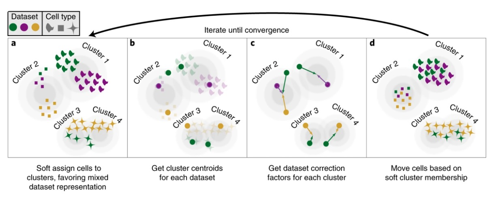
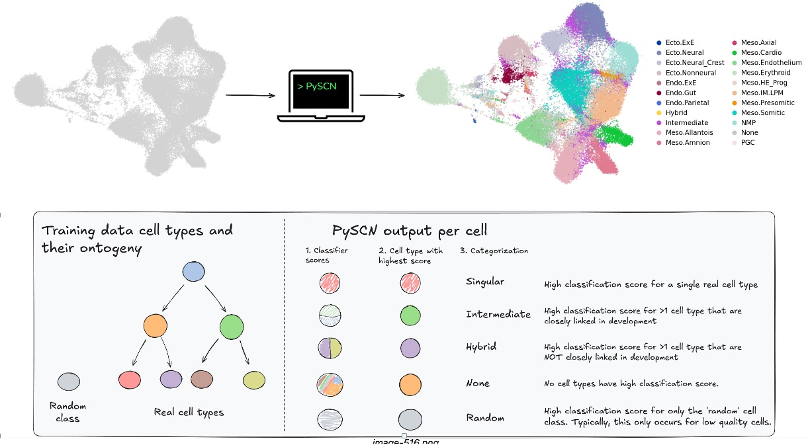

# Cell typing metrics

#### Announcements
- Exam handed out at end
- policy on dropping a exam grade

#### BBKNN:
- explain again key methodological step: each cell gets kNN of cells in each batch
- side effect: k = 3 -> each cell has 3 * number of batches nearest neighbors
- expression estimates and PCs are not altered, only the kNN

#### Harmony

- Harmony is an alternative to BBKNN
- [Paper on Pubmed](https://pubmed.ncbi.nlm.nih.gov/31740819/)
- [Python package](https://github.com/slowkow/harmonypy)

##### How it works
Iterate:
- soft kmeans clustering (does k value matter?)
-  within a cluster, compute batch specific adjustment to push cells in a batch to overall cluster centroid
- PC values of cells updated based on ^ and soft cluster membership

##### Other things
- Performance compared to BBKNN seems similar
- When batches are different times of a process, this method seems to produce knn graphs -> embeddings that are more continous
    - However, they seem to need to be restricted to cells of a shared lineage

#### PySingleCellNet

- What happens when a classification result is not definitive?
- Rationale for 'random' class and for catgorization of prediciton results into 'singlular', etc

#### HW3

- https://compscbio.github.io/cscb2026/hws/hw_3.html
    - Describe the data
    - Gene set enrichment analysis (GSEA)
    - [GSEApy](https://gseapy.readthedocs.io/en/latest/index.html)
    - [Example application with pySCN wrapper to GSEAPY](https://pysinglecellnet.readthedocs.io/en/latest/notebooks/categorize.html#compare-singular-vs-none)

- Performance metrics and parameter sweeps
    - https://compscbio.github.io/cscb2026/notebooks/classification_metrics.html

